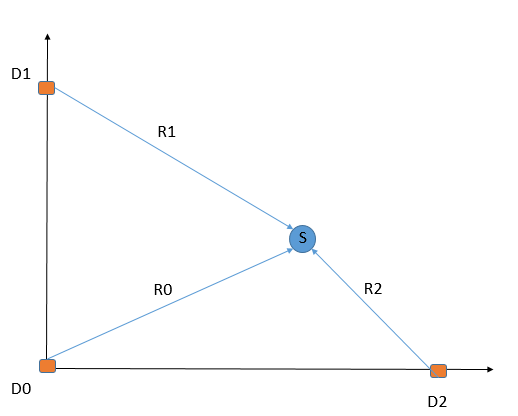

# Aramco_HACK #
## Team: __LATEY__ ##
## Design of a Smart Seismic Node ##

### Problem ### 
Traditional methods for seismic acquisition uses a lot of wires. Such an approach complicate the process as well as wiring approach is not enrgy efficient

### Proposed general solution solution: ###
Create a wireless system that collects data and preforms internal data preprocessing. Such an approach allows to save time, disc space and optimize processing workflows. 
???

### Our goal ##
Create a scaled down solution where set of sensors (sound recievers) located on the grid detects the coordinates of the exploded baloon. Recievers must comunicate wirelessly and broadcasr the baloon coordnate over the network. We optimize the solution to provide coordinates with the least RMS error and optimize the data processing time. 

## Our Solution ##
The solution consists of the multiple parts: 

* Create the network between the recievers
* Collect sound data from the recievers, preform internal preprocessing and send to the ...?
* Analyze data and calculate the time differences between each recievers
* Create the alghorithm that calculates the coordinates of the the souce based on the known reciever locations and time difference with which each recievers recieve the data. 

# Coordinate location alghoritm #

## Scalability ##
Our solution can be 

